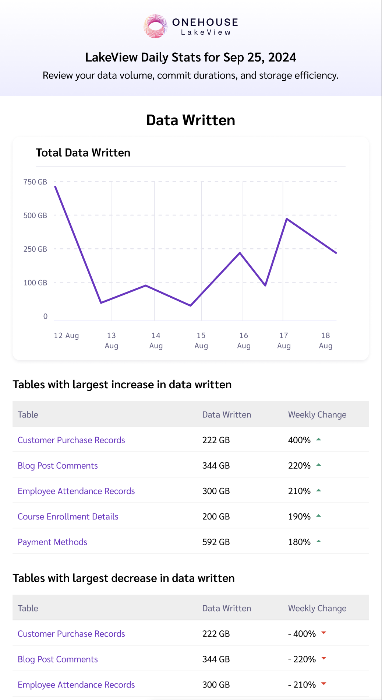
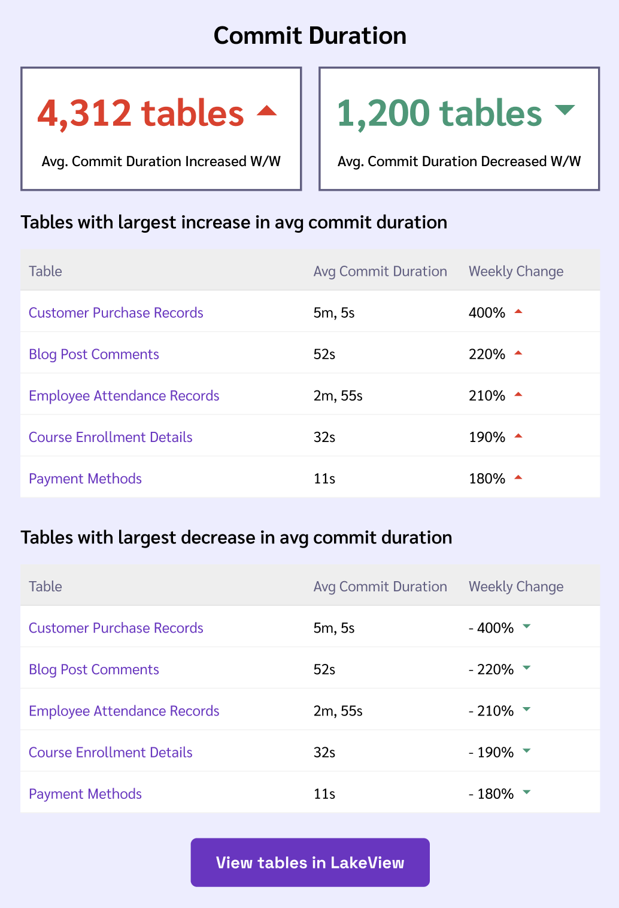
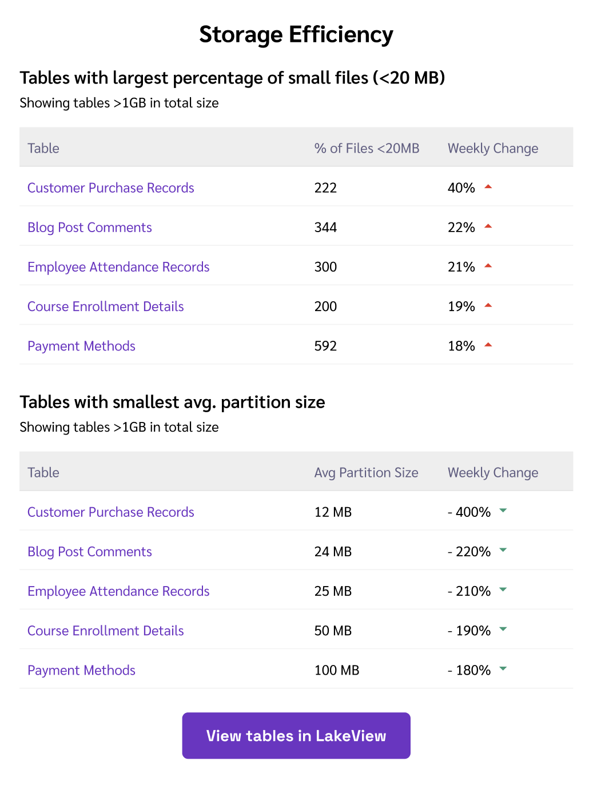

# Table of Contents

- [Intro to LakeView](#intro-to-lakeview)
- [Deployment Models](#deployment-models)
- [Setup Guide](#setup-guide)
  - [Sign Up](#sign-up)
  - [Option 1: Deploy with Pull Model](#option-1-deploy-with-pull-model-recommended)
  - [Option 2: Deploy with Push Model](#option-2-deploy-with-push-model)
  - [Option 3: Deploy with LakeView SyncTool](#option-3-deploy-with-lakeview-synctool)
  - [LakeView Configurations Explained](#lakeview-configurations-explained)
- [Product Walkthrough](#product-walkthrough)
  - [Explore your Tables](#explore-your-tables)
  - [Table Stats](#table-stats)
  - [Timeline History](#timeline-history)
  - [Compaction Backlog Monitoring](#compaction-backlog-monitoring)
  - [Partition Insights](#partition-insights)
  - [Notifications](#notifications)
  - [Weekly Insights Emails](#weekly-insights-emails)
- [FAQ](#faq)
- [Known Limitations](#known-limitations)
- [LICENSE](#license)

# Intro to LakeView

LakeView is a free product provided by Onehouse for the Apache Hudi community. LakeView exposes an interactive interface with pre-built metrics, charts, and alerts to help you monitor, optimize, and debug your data lakehouse tables.

All of this is possible in just a few steps without sending any table base data to LakeView:
1. Visit the [LakeView website](https://www.onehouse.ai/product/lakeview) to request access. You will receive an email when you are approved.
2. Sign up at https://cloud.onehouse.ai/lakeview/signup and create an API token in the Onehouse console.
3. Run the metadata extractor tool in this repo to continuously push table metadata to LakeView (no base data files are pushed).

LakeView currently supports Apache Hudi tables stored on AWS (in Amazon S3) and GCP (in Google Cloud Storage). We plan to support additional clouds and table formats in the future.

**Feature Highlights:**
- UI view of all tables with key metrics and charts (table size, updates over time, etc.)
- Visual searchable timeline history
- Optimization insights for data skew, partition sizing, and file sizing
- Compaction backlog monitoring for Merge on Read tables
- Email & Slack updates and notifications for common issues

> [!TIP]
> Visit the [LakeView website](https://www.onehouse.ai/product/lakeview) to request access. You will receive an email when you are approved.

# Deployment Models

LakeView analyzes the following metadata for your Apache Hudi tables to generate metrics, dashboards, and alerts:
- The instant files in the active and archived timeline of the tables
- The last modification timestamp of the instant files (this is used to incrementally process changes)

LakeView supports three deployment models:
- **Pull Model (Recommended):** Grant LakeView access to your Hudi metadata files with an IAM role template. LakeView will continuously pull the latest metadata.
- **Push Model:** Install and run the metadata extractor software within your cloud environment to push metadata to LakeView.
- **LakeView SyncTool:** Install and run a LakeView SyncTool JAR in your existing Hudi jobs to push metadata to LakeView. This functions similarly to Hudi's catalog integrations, such as the [DataHub SyncTool](https://hudi.apache.org/docs/syncing_datahub/).

**In all deployment models, LakeView analyzes only your Hudi metadata files. Base data files containing records are never accessed and never leave your private cloud.**


# Setup Guide

## Sign Up

1. Visit the [LakeView website](https://www.onehouse.ai/product/lakeview) to request access.
1. You will receive an email when you are approved. Then sign up at https://cloud.onehouse.ai/lakeview/signup.

## Option 1: Deploy with Pull Model (Recommended)

With the Pull Model, you will grant LakeView access to your Hudi metadata files with an IAM role template. LakeView will continuously pull the latest metadata.
1. **Create Role:** Create an IAM Role (AWS) or Service Account (GCP) for LakeView.
   * **AWS:** In the AWS console, create a new IAM Role. Under the "Trust relationships", add the following JSON:
      ```json
      {
        "Version": "2012-10-17",
        "Statement": [
          {
            "Sid": "Statement1",
            "Effect": "Allow",
            "Principal": {
              "AWS": "arn:aws:iam::395578527081:role/onehouse-staging-eks-lv-node-group-role"
            },
            "Action": "sts:AssumeRole"
          }
        ]
      }
      ```
   * **GCP:** In the GCP console, create a new Service Account with the following configurations:
     * New principles: lv-access-sa@infra-staging-354809.iam.gserviceaccount.com
     * Role: Service Account Token Creator
1. **Download Config File:** In the [LakeView console](https://cloud.onehouse.ai/lakeview/signup), download the configuration file from the LakeView console and fill in all configurations. See details on each configuration [here](#lakeview-configurations-explained).
1. **Fill in & Upload Config File:** In the LakeView console, upload the filled-in configuration file.
1. **Apply IAM Role:** LakeView will automatically generate an IAM template from the configuration file you uploaded. In the LakeView console, download this IAM template. Then apply the permissions in your cloud account:
   * **AWS:** In the AWS console, navigate to your IAM Role. Click "Add Permissions" > "Create Inline Policy" and paste the downloaded IAM template JSON.
   * **GCP:** In the GCP console, navigate to Service Principles. Select your Service Principle, click "Grant Access", then assign the "Storage Object Listener" and "Storage Object Viewer" roles. On the same page, click "Add Condition" (for each IAM role in your downloaded template), then copy in the Title, Description, and Conditions from the IAM template.
     * **Note:** In GCP, Object List permissions must be granted for an entire bucket - this does not allow Onehouse to read the actual files. The Object Access permissions for reading the files are granularly scoped to the Hudi metadata.

After you complete these steps, LakeView will continuously pull metadata for your tables to generate dashboards and insights.

## Option 2: Deploy with Push Model

With the Push Model, you will install and run the metadata extractor software within your cloud environment to push metadata to LakeView.
1. Open the [LakeView console](https://cloud.onehouse.ai/lakeview/signup).
1. Create an API Key in the LakeView console. In the sidebar, open Settings > API Settings, then generate a new token.
1. Download the configuration file from the LakeView console and fill in all configurations.
1. Deploy the metadata extractor tool to push metadata.

**To deploy the metadata extractor tool, use one of the options below for (2a) JAR, (2b) Docker, or (2c) Kubernetes.**

### Option 2a: Download JAR to Push Metadata

1. Download the metadata extractor JAR from the [releases page](https://github.com/onehouseinc/LakeView/releases/). Here is an example for downloading version 0.14.0 of the JAR:
  ```BASH
  curl -o /tmp/LakeView-release-v0.14.0-all.jar \
    https://github.com/onehouseinc/LakeView/releases/download/prod-34/LakeView-release-v0.14.0-all.jar
  ```
1. Download the Push Model configuration file from the Onehouse console, then fill in the configurations.
1. Run the JAR to push your data to LakeView. Pass the configuration file as string or file to the JAR.

**Example running in AWS Glue:**
1. Upload your downloaded LakeView JAR file to an Amazon S3 location accessible via an IAM role used by the Glue job.
1. Configure the Glue Job details.
   * Set up the IAM role to be used by glue. **Note**: This role should be able to access the JAR file from S3 and also to the base paths mentioned in the config.
   * Under `Advanced properties > Libraries`, specify the JAR's S3 location in `Python library path` & `Dependent JARs path` fields.
1. Create a Glue job with a script. Please find a sample script to be used in Glue below. Here, the config.yaml is embedded as part of the script itself. This is a minified version of the same config.yaml file. Please update the parameters like `PROJECT_ID`, `API_KEY`, `API_SECRET`, `USER_ID`, `REGION`, `LAKE_NAME`, `DATABASE_NAME`, `BASE_PATH_1`, `BASE_PATH_2`, etc. in the config.
```python
import pyspark
import pyspark.sql.types as T
from awsglue.transforms import *
from awsglue.context import GlueContext
from pyspark.context import SparkContext

conf = pyspark.SparkConf()

glueContext = GlueContext(SparkContext.getOrCreate(conf=conf))

spark_session = glueContext.spark_session
spark_session.udf.registerJavaFunction(name="glue_wrapper", javaClassName="ai.onehouse.GlueWrapperMain", returnType=T.StringType())
spark_session.sql("SELECT glue_wrapper('[\"-c\", \"{version: V1, onehouseClientConfig: {projectId: ${PROJECT_ID}, apiKey: ${API_KEY}, apiSecret: ${API_SECRET}, userId: ${USER_ID}}, fileSystemConfiguration: {s3Config: {region: ${REGION}}}, metadataExtractorConfig: {jobRunMode: ONCE, parserConfig: [{lake: ${LAKE_NAME}, databases: [{name: ${DATABASE_NAME}, basePaths: [${BASE_PATH_1}, ${BASE_PATH_2}]}]}]}}\"]') as answer").show()
```

### Option 2b: Install Docker Image to Push Metadata

1. Download the Push Model configuration file from the Onehouse console, then fill in the configurations. You can pass this configuration content as string or file to docker command.
1. Run the LakeView using Docker.
  ```BASH
  # Deploy with YAML configuration string
  docker run onehouse/lake-view -c '<yaml_string>'

  # Deploy with YAML configuration file (local filepaths only)
  docker run onehouse/lake-view -p '<path_to_config_file>'
  ```
  Note: When testing Docker locally, use `-v` to mount the volume where the configuration is present.
  ```BASH
  # Example running Docker locally
  docker run -v /tmp/lakeview_conf.yaml:/tmp/lakeview_conf.yaml onehouse/lake-view -p /tmp/lakeview_conf.yaml
  ```

### Option 2c: Install Kubernetes Helm Chart to Push Metadata

1. Clone the LakeView github repo:
  ```BASH
  git clone https://github.com/onehouseinc/LakeView.git
  ```
1. Navigate into the helm-chart folder:
  ```BASH
  cd helm-chart
  ```
1. Update `values.yaml` file with required field values. You can refer the fields in [supported_values](helm-chart/values.yaml) file.
1. Download the Push Model configuration file from the Onehouse console, then fill in the configurations and copy them into your `values.yaml` file.
1. Install the LakeView using helm:
  ```BASH
  helm install lake-view . -f values.yaml
  ```

## Option 3: Deploy with LakeView SyncTool

Install and run a LakeView SyncTool JAR in your existing Hudi jobs to push metadata to LakeView. This functions similarly to Hudi's catalog integrations, such as the [DataHub SyncTool](https://hudi.apache.org/docs/syncing_datahub/).
1. Download the latest LakeView SyncTool JAR from the [LakeView Maven repository](https://repo1.maven.org/maven2/ai/onehouse/lakeview/).
1. Run the SyncTool JAR asynchronously or in-line with the Hudi Streamer (examples below).

**Class**
`org.apache.hudi.sync.LakeViewSyncTool`

**Configurations Specification**
```
hoodie.meta.sync.lakeview.version=V1
hoodie.meta.sync.lakeview.projectId=<LakeView-project-id>
hoodie.meta.sync.lakeview.apiKey=<api-key>
hoodie.meta.sync.lakeview.apiSecret=<api-secret>
hoodie.meta.sync.lakeview.userId=<user-id>

hoodie.datasource.lakeview_sync.timeout.seconds=optional>

hoodie.meta.sync.lakeview.s3.region=<aws-region>
hoodie.meta.sync.lakeview.s3.accessKey=<optional>
hoodie.meta.sync.lakeview.s3.accessSecret=<optional>

hoodie.meta.sync.lakeview.gcs.projectId=<optional-projectId>
hoodie.meta.sync.lakeview.gcs.gcpServiceAccountKeyPath=<optional-path_to_gcp_auth_key>

hoodie.meta.sync.lakeview.metadataExtractor.pathExclusionPatterns=<pattern1>,<pattern2>,...

hoodie.meta.sync.lakeview.metadataExtractor.lakes.<lake1>.databases.<database1>.basePaths=<basepath11>,<basepath12>
hoodie.meta.sync.lakeview.metadataExtractor.lakes.<lake1>.databases.<database2>.basePaths=<path1>,<path2>
```

**Example S3 Configuration File for Hudi Streamer**
```
hoodie.datasource.lakeview_sync.enable=true
hoodie.base.path=s3://user-bucket/lake-1/database-1/table-2
hoodie.meta.sync.lakeview.version=V1
hoodie.meta.sync.lakeview.projectId=00000000-0000-0000-0000-000000000000
hoodie.meta.sync.lakeview.apiKey=9c0a5da7-56e9-4004-be0e-66c229a096d8
hoodie.meta.sync.lakeview.apiSecret=dummy-api-secret
hoodie.meta.sync.lakeview.userId=66a29172-dc7b-4571-9190-c200c0540360

hoodie.datasource.lakeview_sync.timeout.seconds=30

hoodie.meta.sync.lakeview.s3.region=s3
hoodie.meta.sync.lakeview.s3.accessKey=dummyS3AccessKey
hoodie.meta.sync.lakeview.s3.accessSecret=dummyS3AccessSecret

hoodie.meta.sync.lakeview.metadataExtractor.pathExclusionPatterns=s3://user-bucket/lake-1/database-3,s3://user-bucket/lake-1/database-4,

hoodie.meta.sync.lakeview.metadataExtractor.lakes.lake-1.databases.database-1.basePaths=s3://user-bucket/lake-1/database-1/table-1,s3://user-bucket/lake-1/database-1/table-2
hoodie.meta.sync.lakeview.metadataExtractor.lakes.lake-1.databases.database-2.basePaths=s3://user-bucket/lake-1/database-2/table-1,s3://user-bucket/lake-1/database-2/table-2
hoodie.meta.sync.lakeview.metadataExtractor.lakes.lake-2.databases.database-1.basePaths=s3://user-bucket/lake-2/database-1/table-1,s3://user-bucket/lake-2/database-1/table-2
hoodie.meta.sync.lakeview.metadataExtractor.lakes.this-is-an-invalid-property=s3://user-bucket/lake-2/database-1/table-1,s3://user-bucket/lake-2/database-1/table-2
```

**Example Running Ad Hoc in Command Line**
```
java -cp lakeview-sync-tool-1.0-SNAPSHOT-all.jar ai.onehouse.lakeview.sync.LakeviewSyncTool --base-path s3://jenkinsintegration-tests/20241016085523/community-edition-non-blocking --version V1 --project-id c7c2d2c9-e906-4507-a277-352216195cd0 --api-key API_KEY --api-secret API_SECRET --userid o1d2LfHuJ5RPnyw1eOYizIoexm32 --s3-region us-west-2 --lake-paths sync-tool-test-lake.databases.sync-tool-0.basePaths=s3://jenkinsintegration-tests/20241016085523/community-edition-non-blocking
```

## LakeView Configurations Explained

The LakeView configurations vary slightly in each deployment model. Follow the instructions in the previous sections to get the configuration template for your chosen deployment model.

Below are explanations for the superset of all configurations across the three deployment models:

### Pull Model Configurations
> [!IMPORTANT]
> - **version:** Specify the configuration format version. Currently, only version V1 is supported.
> - **cloud:** Specify details about the cloud environment where the tables are stored.
>   - **type:** AWS or GCP.
>   - **region:** Your AWS region (exclude this for GCP).
>   - **roleIdentifier:** Your AWS ARN or GCP Service Account, created in the first step.
> - **pathExclusionPatterns:** List of regex patterns to exclude from scanning. (Java regex patterns are supported)
> - **parserConfig:** List of lakes and databases to be parsed.
>   - **lake:** Name of the lake (optional, defaults to community-lake). This can be used to organize tables in the Onehouse console under the format Lake > Database > Table.
>     - **databases:** List of databases and their respective base paths. This can be used to organize tables in the Onehouse console under the format Lake > Database > Table.
>       - **name:** Database name (optional, defaults to community-db ).
>       - **basePaths:** List of paths which the extractor needs to look into to find hudi tables. the paths can be paths to hudi tables or a path to a directory containing hudi tables. The paths should start with `s3://` when using S3 or `gs://` when using GCS.

### Push Model Configurations
> [!IMPORTANT]
> - **version:** Specify the configuration format version. Currently, only version V1 is supported.
> - **onehouseClientConfig:** Credentials for comnmunicating with Onehouse. These values can be obtained from the Onehouse console.
>   - **projectId:** Your Onehouse project ID. Get this by clicking on your profile in the top right of the Onehouse console.
>   - **apiKey:** The API key for authentication. Get this by opening Settings > API Settings in the Onehouse console and creating an API key.
>   - **apiSecret:** The corresponding secret for the API key. Get this by opening Settings > API Settings in the Onehouse console and creating an API key.
>   - **userId:** The user ID for accessing the service. Get this by clicking on your profile in the top right of the Onehouse console.
> - **fileSystemConfiguration:** Authentication configuration to access file system. Include only one of the s3Config (for AWS) or gcsConfig (for GCP).
>   - **s3Config:**
>     - **region:** AWS region of the S3 bucket.
>   - **gcsConfig:**
>     - **projectId:** <optional projectId>
> - **metadataExtractorConfig:**
>   - **jobRunMode:** Can be CONTINUOUS or ONCE.
>     - `CONTINUOUS` - The tool periodically discovers and uploads metadata for tables found in the configured path. Table discovery happens every 30minutes and new commit instants for the files are discovered and extracted every 5minutes (provided the previous run has completed).
>     - `ONCE` - Allows users to trigger the discovery and extraction flow on demand, the tool picks up from where it left off on the last run. This can be useful if you want to run the metadata extractor tool as a recurring job that you manage.
>   - **uploadStrategy:** Can be BLOCK_ON_INCOMPLETE_COMMIT or CONTINUE_ON_INCOMPLETE_COMMIT. 
>     - `BLOCK_ON_INCOMPLETE_COMMIT` - The job stops when it encounters an incomplete commit. In the next run, the job will start from the incomplete commit.
>     - `CONTINUE_ON_INCOMPLETE_COMMIT` - The job skips incomplete commits to continue processing the complete commits in the next run.
>   - **pathExclusionPatterns:** List of regex patterns to exclude from scanning. (Java regex patterns are supported)
>   - **parserConfig:** List of lakes and databases to be parsed.
>     - **lake:** Name of the lake (optional, defaults to community-lake). This can be used to organize tables in the Onehouse console under the format Lake > Database > Table.
>       - **databases:** List of databases and their respective base paths. This can be used to organize tables in the Onehouse console under the format Lake > Database > Table.
>         - **name:** Database name (optional, defaults to community-db ).
>         - **basePaths:** List of paths which the extractor needs to look into to find hudi tables. the paths can be paths to hudi tables or a path to a directory containing hudi tables. The paths should start with `s3://` when using S3 or `gs://` when using GCS.

# Product Walkthrough

## Explore your Tables

After you have pushed your metadata, you should see a “Metadata received” banner on the homepage. You can view your tables by clicking the link on this banner or the “Data” tab on the sidebar.


On the Data page, you will see all of your tables organized under Lakes and Databases. Click on a table to view the relevant dashboards, metrics, and history.

## Table Stats

Table statistics give you a birds-eye view of the table’s status and key trends. You can track the volume of data written and other important metrics to help you understand your tables.

Click the “Overview” tab under the table to see statistics about the table.


## Timeline History

Timeline History gives you a searchable, visual interface for the Hudi timeline. This can be particularly useful when debugging issues with your tables.

Click the “History” tab under the table to see the Hudi timeline history. This view shows timeline events such as Commits, Cleaning, and Clustering. You can search and filter for particular table events.


If you want to view additional details about a timeline event, click “Details”.


## Compaction Backlog Monitoring

Compaction Backlog Monitoring (available for Merge on Read tables only) can help you identify log file build-ups that cause out-of-date data, or identify opportunities to optimize your compaction settings.

Click the “Compaction Backlog” tab under the table to see the status of recent compactions and log file build-up.


**Identifying compaction issues**
For Merge on Read tables, your real-time views will be outdated if data is not compacted. You can identify uncompacted file groups by checking the number of log files and the time of last compaction. If log files are increasing significantly or compaction has not run in a long time on a file group, you should ensure that compaction is running and consider adjusting your compaction strategy.

## Partition Insights

Partition Insights can help you optimize your table performance by improving partition schemes. You may also track partition skew and file size issues that affect performance.

Click the “Partition Insights” tab under the table to see charts and statistics about your partition sizes.


**Optimizing partition sizes:** Operations are typically most efficient when partitions are similar in size. Onehouse provides insights to identify partition sizing inefficiencies:
The Partition Size Distribution chart shows the number of partitions that fall into each size range. Ideally, this chart should look like a bell curve with most partitions near the average size and the range (difference between the max and min partition size) should be small.
Data Skew indicates if a partition is significantly smaller or larger in total size than the average partition in the table. Onehouse If you find that the Data Skew is high in magnitude for certain partitions, you may reconsider your partitioning strategy to even out partition sizes.

**Optimizing file sizes:** Small file sizes can lead to poor query performance because they require you to scan more files in order to query data. You can use the p10, p50, etc. file sizes to understand if a partition contains small files. If you identify small files, review your file sizing configs and ensure that these services are running properly. Feel free to leverage the Hudi Slack community for further support on any questions.

## Notifications

Notifications allow you to receive alerts to proactively identify issues and inefficiencies in your tables.

Click the “Notifications” page in the sidebar or the bell icon at the top of the screen to open notifications. By default, notifications are turned off. To turn on notifications, click the gear icon on the notifications page and configure your notification settings.


## Weekly Insights Emails

LakeView will send you weekly insights emails to help you stay on top of important activity in your Hudi deployment. These emails include trends, new tables, and potential issues.

No action is required to set up weekly review emails – you will receive them automatically when you create or join a LakeView project.





# FAQ

## How does LakeView keep my data secure?

LakeView interacts only your Hudi metadata files. Base data files containing records are never accessed and never leave your private cloud.
  - It does not access, move, or control actual data files, ensuring the integrity and confidentiality of your data. This significantly reduces the security impact.
  - Any information sent back and forth is encrypted at rest and in transit.
  - While lakeview does not have native SSO integrations, any SSO that you already have in place for Google or Microsoft authentication will still take effect. 

## How does LakeView process metadata efficiently?

LakeView utilizes checkpoints for incremental metadata extraction, enabling frequent and efficient metric updates.

## How is LakeView different from Onehouse Cloud?

LakeView is a standalone product offered by Onehouse for free to the Apache Hudi community. These are the core differences between the two products:

| | LakeView | Onehouse Cloud |
|-|-|-|
| **Description** | Observability tools to help you analyze, debug, and optimize Apache Hudi tables | Fully managed ingestion and incremental ETL pipelines, managed table services, and interoperability with Apache Hudi, Apache Iceberg, and Delta Lake. [Learn more.](https://www.onehouse.ai/product) |
| **Cost** | Free | Free for 30 days, then compute-based pricing |
| **Deployment** | You send Onehouse your Hudi metadata. Onehouse processes the metadata and exposes metrics and charts on the Onehouse console. | Onehouse deploys an agent in your Cloud account to manage clusters and jobs without sending data out of your VPC. Only the Hudi metadata is sent to Onehouse to populate the Onehouse console. |
| **Who's it for** | Apache Hudi users with existing data lakes | 1) Anyone looking to build new ingestion or ETL pipelines with Apache Hudi, Apache Iceberg, and/or Delta Lake OR 2) Apache Hudi users who want managed table services |

## Will LakeView see my column stats if I have enabled the Hudi metadata table?

Onehouse will NOT see your column stats. While column stats are present in the [metadata table](https://hudi.apache.org/docs/metadata) under the .hoodie folder, the metadata extractor tool does not send the metadata table to the Onehouse endpoint. We only copy the commit files in .hoodie and .hoodie/archived. We do not copy the content of any other folders in the .hoodie directory. 

# Known Limitations
 
When using the metadata extractor tool, it's important to be aware of certain limitations that can affect its functionality and the accuracy of the metrics provided.

**Issues with Tables having same name in a (lake, database)**
- Scenario: If two tables having the same name are present in the same (lake, database) pair, the tool will not be able to distinguish between them.
- Implication: This will lead to failure in table initialization, and you would see an error something like below in the metadata extractor logs.
    ```
    A table already exists in Lake: <lake-id> database: <db-name> with this name: <table-name>. Please consider ingesting this table under a different lake or database to avoid conflicts
    ```
- Resolution: Users should ensure that tables have unique names within a (lake, database) pair. If there are multiple tables with the same name, consider moving them to different databases.

**Issues with Re-created Tables in the Same Path**
- Scenario: If a Hudi table is deleted and a new table is created in the same path, the tool assigns the same table ID as the previous one.
- Implication: This can lead to inaccuracies in the metrics calculation.
- Resolution: Users should delete such tables from the Onehouse console to avoid metric calculation issues.

**Changing Lake or Database Names After Metric Ingestion**
- Scenario: If the lake or database name for a given base path is changed after metrics have already been ingested, the tool will not use the new names.
- Implication: Continuity in metric tracking may be lost due to the change in identifiers.
- Resolution: Users should delete the table from the Onehouse console before making such changes.

**Changing Table Type After Metric Ingestion**
- Scenario: If the table type is changed after metrics have already been ingested, the tool will not use the new table_type.
- Implication: Some metric calculations could be wrong.
- Resolution: Users should delete the table from the Onehouse console before making such changes.

**Pausing and Resuming Metadata Ingestion**
- Scenario: If metadata ingestion for a table is paused and then resumed after a few days, there's a risk that the metrics displayed may be inaccurate (mainly depends on archival configs).
- Reason: The tool processes the archived timeline only once when the table is first discovered. If new instants are committed and moved to the archived timeline while the tool is not running, these instants will not be uploaded upon resumption, leading to potential data loss.
- Implication: There can be a mismatch between the actual table state and the metrics shown.
- Resolution: Users should delete the table from the Onehouse console before running the tool again in case of long wait times.

# LICENSE

This repository is licensed under the terms of the Apache 2.0 license.
